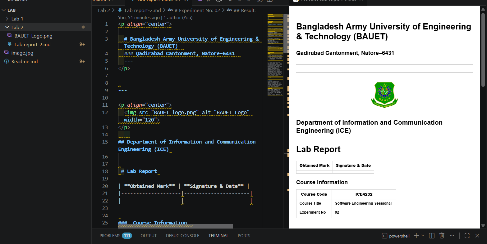

  # Bangladesh Army University of Engineering & Technology (BAUET)  
  ### Qadirabad Cantonment, Natore–6431  
  ---

---

  

    
## Department of Information and Communication Engineering (ICE) 

 # Lab Report 

| **Obtained Mark** | **Signature & Date** |
|--------------------|----------------------|
|                    |                      |

###  Course Information  

| **Course Code** | **ICE4232** |
|------------------|--|
| **Course Title** | **Software Engineering Sessional**  |
| **Experiment No** | **02**  |
| **Experiment Title** | **Study of different git commands.**  |

---

| **Submitted By** | **Submitted To** |
|------------------|------------------|
| **Name: Abu Nagib Mohd. Mauwn Mahamud** | **Name: Sudipto Saha** |
| **Student ID: 0812220205171008** | **Designation: Lecturer** |
| **Batch: 13^th^** | **Dept: ICE** |
| **Year: 4^th^** |  |
| **Semester: 2nd** |  |

---

| **Date of Experiment** | **Date of Submission** |
|-------------------------|------------------------|
|   30.07.25                      |     27.08.2026                   |

---

# Experiment No: 02  
## Experiment Name: Study of different Git commands

## Objectives
i. To become familiar with frequently used Git commands.
ii. To establish and oversee Git repositories. 
iii. To keep track of modifications and handle various file versions.  
iv. To comprehend how Git facilitates teamwork in software development.

## Theory

Git is a widely used distributed version control system that helps developers manage and track changes in software projects. It allows users to maintain different versions of files, identify modifications, and return to previous versions when necessary. Git also makes collaboration easier by allowing multiple developers to work on the same project without losing each other’s changes. In this experiment, different commonly used Git commands are studied and practiced to understand their purposes and operations. The experiment includes creating and managing repositories, tracking files, staging and committing changes, viewing commit history, creating branches, switching between branches, and merging changes. It also introduces remote repositories and basic collaboration using GitHub. Through this experiment, students can develop a practical understanding of Git and learn how version control supports organized and efficient software development.

## Result:

## Conclusion

This experiment provided a practical understanding of Git and its commonly used commands. We learned how to create repositories, track changes, commit files, manage versions, create branches, and merge changes. Git also demonstrated its importance in collaborative software development by maintaining project history and supporting efficient teamwork among developers.

## References:
[1] R. M. Stallman, R. Pesch, and S. Shebs, Debugging with GDB: The GNU Source-Level Debugger, 10th ed. Boston, MA, USA: Free Software Foundation, 2024, pp. 1–80.
[2] M. A. Pilato, B. Collins-Sussman, and B. W. Fitzpatrick, Version Control with Subversion, 2nd ed. Sebastopol, CA, USA: O’Reilly Media, 2008, pp. 1–28.
[3] J. Loeliger and M. McCullough, Version Control with Git, 2nd ed. Sebastopol, CA, USA: O’Reilly Media, 2012, pp. 1–56.